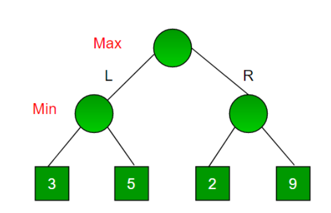
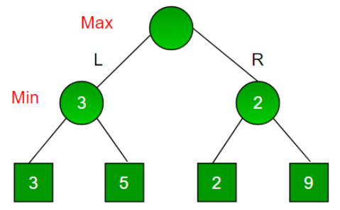
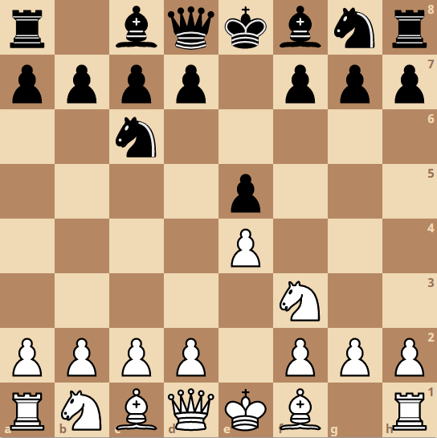

# Chess Engine

A chess engine that you can play against.

## Resources

* Active site: https://chessengine-play.herokuapp.com/
* Front-end code: https://github.com/arnoldmak12/FrontEnd-ChessEngine

## Table of Contents

- [How it Works](#how-it-works)
    - [Minimax](#minimax)
        - [Pruning](#pruning)
            - [Alpha-beta pruning](#alpha-beta-pruning)
            - [Null move pruning](#null-move-pruning)
            - [Move heuristics](#move-heuristics)
    - [Quiescence Search](#quiescence-search)
    - [Iterative Deepening](#iterative-deepening)
    - [Transposition Tables](#transposition-tables)
        - [Hashing](#hashing)
        - [Principal Variation](#principal-variation)
    - [Evaluation](#evaluation)
- [Built With](#built-with)
- [Further Reading](#further-reading)
- [Authors](#authors)

## How It Works

The engine aims to determine the best move from a given chess position. To do so, a tree of possible future game states is constructed from the current position. By traversing through the tree, we can determine which future positions would be favorable, and aim to take the path that would take us to the most favorable position. 

The way we calculate this is done with the **minimax algorithm.**

### Minimax

Minimax is a backtracking algorithm that helps dictate which path is optimal from a given node in the tree, assuming your opponent also plays optimally.

Each node in the tree represents a position, which can be given a *score*. One player is a **maximizer**, who tries to get the highest score possible. The other is the **minimizer**, who aims to get the lowest. Because chess is a turn based game, the levels of the tree alternate between maximizing and minimizing the score.

We can determine which path is optimal by starting at the base of the tree and **working our way up**. Consider the following example:



* If the maximizer goes left, the minimizer can choose a 3 or a 5. They would choose 3, so going left results in a score of 3.

* If the maximizer goes right, the minimizer can choose a 2 or 9. They would choose 2, so going right results in a score of 2.

With this new information, we can fill in the tree like this:



From here, its clear to see that the maximizer **should choose the left path**.

As the tree grows in height, the number of nodes grows *exponentially*. In order to deal with this issue, we can apply methods to reduce the number of nodes we need to evaluate.

#### Pruning
 
Chess is a complicated game, with an average of around 35 possible moves for a given position. 
* At a depth of 6, the tree of possible game states would have a staggering **1,838,265,625 nodes.**

In order to greatly reduce the number of nodes we have to look through, we can determine which branches do not need to be searched, effectively *pruning* them from the tree. There are many different ways we can decide to skip a branch.
 
#### Alpha Beta Pruning
 
The most common type of pruning is alpha beta pruning. The idea is to keep track of two variables, alpha & beta.

* Alpha is the **lowest** score the **maximizing** player is assured of.
* Beta is the **highest** score the **minimizing** player is assured of.

If there is a point where a player has a **guarenteed** better move than the current move being evaluated, then no further evaluation is needed on the move, since the minimax algorithm will not pick it anyways. **This happens whenever alpha > beta.**

~~~
//A better move has already been found, so stop evaluation
if(alpha > beta) {
    break;
}
~~~

Reconsider the following example:


Now lets assume the computer has just finished evaluating the left side of the tree and begins evaulating the right. At this point in time, the maximizer is **guarenteed** to get a score of at least 3, so alpha is 3.

The minimizer will check left first, and see it results in a score of 2. At this point, the minimizer is **guarenteed** to get a score of at most 2, so beta is 2.

Because alpha > beta, an **alpha beta cutoff** has been found. We can stop evaluation without the minimizer ever checking the right path, and the result of the tree is the same.

#### Null Move Pruning

In most chess positions, doing something is better than doing nothing at all. That is, if it were possible to "pass" your turn to your opponent, chances are you had a better move available. This is where the idea of null move pruning comes in:
* We pass on a turn (perform a *null move*) and search the tree to a limited depth. 
* If this results in an alpha beta cutoff, chances are there is another move available to us that will also produce a cutoff.
* Hence, we can prune the branch without searching further.

Certain conditions need to be met before performing a null move: 
1. If you are currently in check, a null move would result in an illegal position. 
2. If you are currently in the end game, a null move could give an innacurate evaluation.

*Zugzwang* is a term that refers to chess positions where the best option would be to pass your turn to the opponent. **This contradicts our assumption** made for null move pruning. Since these positions are more common in the end game, null move pruning is disabled there.

#### Move Heuristics

The effectiveness of alpha beta pruning can be greatly enhanced by the order in which moves are checked. The sooner the best move is found, the sooner a cutoff will be produced, and **the more work we can avoid.**

We cant know which move will be considered best, but we can make an educated guess by ordering them with a certain method, or *heuristic*.

Capturing a piece tends to lead to a bigger change in evaluation, so these are checked first. Captures are ordered based on *MVVLVA* move ordering, which stands for **Most Valuabe Victim, Least Valuable Attacker.**
* Taking a piece of high value (victim) has a great chance of being the best move.
* Taking a piece with a low value piece (attacker) tends to be a good idea, as they are likely to be captured by your opponent.

Its also a good idea to give checks and promotions higher priority. The order of the remaining moves is arbitrary.

### Quiescence Search

Imagine a chess player looked 5 moves ahead and saw they could take one of their opponent's pawns with the queen on the final move. They think this is a great variation for them, since they've won a pawn.

But by stopping at 5 moves, they missed that the pawn was defended, so their opponent could simply **recapture the queen** with another pawn. What was thought to be winning material actually turned out to be **a catastrophic blunder.**

This is a common problem known as the **horizon effect**. One move can drastically change who has the advantage in a game of chess. Instead of stopping at a certain depth, it's much better to stop when the position is *quiet*, or when the evaulation is unlikely to change drastically after another move.

A chess position is considered **quiet** when:
1. There are no moves that capture a piece.
2. There are no moves that put the king in check.
3. There are no pawn promotions available.

After the main tree hits the max depth, the branch enters a **quiescence search** where only captures, checks, and promotions are considered, ending once the position is quiet. This search has a much smaller branching factor and can reach a depth of **over 20 moves** in certain branches.

### Iterative Deepening

Iterative deepening is a technique that searches the tree repeatedly, with increasing depths on each search.

* Essentially, it combines **depth-first** search with **breadth-first** search.

By searching the tree in this fashion, the information stored in **transposition tables** gets used and is updated much more frequently, which means we have less work to do overall.

### Transposition Tables

Consider the following move sequences:
```
1. e4 e5 2. Nf3 Nc6
```
```
1. Nf3 Nc6 2. e4 e5
```
While the order of moves is different, both lead to the same position:



This is called a **transposition.** 

When performing a move search, transpositions are quite common. By storing the evaluation results of the positions we encounter in a **transposition table**, we can just use the stored result instead of doing the work all over again.

#### Hashing

In order to store results for a given chess position, we need to figure out a way to uniquely identify it. And since we will be doing this at **every node in the tree**, we need a way to do it fast.

*Zobrist hashing* is a **tabulation hashing** method that aims to assign each position a unique bitstring. Once generated, the hash can easily be updated with only 4 bitwise XOR operations, making it extremely quick to update and get for a given chess position.

#### Principal Variation

We can also keep track of which move was determined to be the best in a previous search, or the **principal variation**. This move will be checked first.

* If a move was considered best in a *previous* search, there's a good chance it will be considered best in this one.

These can be stored in a separate transposition table.

### Evaluation

In order to choose what positions are favorable, we need a way to accurately *evaluate* a given chess position. **How a position is evaluated dictates the behavior of the AI**.

There are many factors that influence who has the advantage, including:

1. General piece values
2. King safety
3. Piece position
4. Pawn structure
5. Spacing/Mobility

These, as well as additional factors, are taken into account to give a numeric value, or *score*, representing which side has the advantage. A positive score is favorable for white, while a negative score is favorable for black.

## Built With
* React
* C#
* Deployed FrontEnd to Heroku
* Deployed BackEnd to Azure

## Further Reading

- [Minimax algorithm](https://www.baeldung.com/java-minimax-algorithm)
- [Evaluating a chess position](https://www.chessprogramming.org/Evaluation)
- [Zobrist hashing](https://iq.opengenus.org/zobrist-hashing-game-theory/)
- [General chess programming info](https://www.chessprogramming.org/Main_Page)

## Authors
* [Jasen Lai](https://www.linkedin.com/in/jasenlai/) - The Ohio State University
* [Arnold Makarov](https://www.linkedin.com/in/arnoldmakarov/) - The Ohio State University
* [Jacob Maxson](https://www.linkedin.com/in/jacob-maxson-63869018a/) - The Ohio State University
* Jaewook Lee - The Ohio State University
